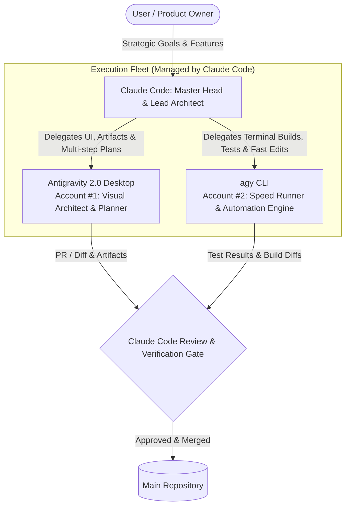

# The Multi-Agent Orchestration Playbook ("The Book")
**Architecture, Delegation Protocol & Operations Manual**

---

## 1. The Command Hierarchy & Org Chart



### Roles & Responsibilities

| Agent / Surface | Role Title | Primary Mandate | Quota / Account |
| :--- | :--- | :--- | :--- |
| **Claude Code** | **Master Head & Chief Architect** | System architecture, task decomposition, git coordination, high-level code review, writing tests, edge-case resolution, and final sign-off. | Anthropic Claude Subscription |
| **Antigravity Desktop** | **Visual Co-Lead & Feature Planner** | Multi-file frontend refactoring, visual documentation, interactive artifacts, subagent delegation, and component design. | AGY Account #1 |
| **`agy` CLI** | **Fast Build & Terminal Engine** | Running builds (`npm run build`), integrity checks (`npm run check`), test scripts, rapid terminal hotfixes, and background worker jobs. | AGY Account #2 (`--dangerously-skip-permissions`) |

---

## 2. The Communication Bus (`TASK_BOARD.md`)

Because agents cannot talk across processes in memory directly, they communicate via a **file-based blackboard**: `TASK_BOARD.md` at the project root.

### The Ticket Lifecycle
1. **CREATION**: Claude Code defines tasks with clear inputs, expected files, and test criteria in `TASK_BOARD.md`.
2. **CLAIM**: An AGY agent marks the ticket `[IN_PROGRESS]` and lists its working branch.
3. **SUBMISSION**: AGY completes the work, verifies local build, and marks ticket `[NEEDS_REVIEW]`.
4. **INSPECTION & MERGE**: Claude reviews the diff, runs verification commands, marks `[DONE]`, and merges to `main`.

---

## 3. Git Isolation Protocol (Zero Collisions)

Never let two agents write to the same working tree simultaneously. Claude enforces the **Worktree Isolation Standard**:

```powershell
# Directory layout:
D:\Healthcare international group\              <-- Claude Code (main orchestrator)
D:\Healthcare international group-agy-desktop\  <-- AGY Desktop (feature/desktop-ui)
D:\Healthcare international group-agy-cli\      <-- agy CLI (feature/cli-runner)
```

### Setting up Worktrees:
```powershell
# For AGY Desktop:
git worktree add "../Healthcare international group-agy-desktop" -b feature/agy-desktop-task

# For agy CLI:
git worktree add "../Healthcare international group-agy-cli" -b feature/agy-cli-runner
```

---

## 4. Claude Code Master Commands & Dispatch Prompts

When you talk to **Claude Code**, use these dispatch prompts:

### To break down and assign a big feature:
> *"Claude, act as the Master Head. Plan feature [Feature Name]. Break it down into subtasks in `TASK_BOARD.md`, assign the UI/component work to Antigravity Desktop, and assign the test/build validation to agy CLI."*

### To review work done by an AGY agent:
> *"Claude, review the branch `feature/agy-desktop-task` completed by Antigravity Desktop. Check diffs against our standards, run `npm test`, and if clean, merge into main and update `TASK_BOARD.md`."*

---

## 5. AGY Prompts (For Desktop & CLI)

### In Antigravity Desktop:
> *"Check `TASK_BOARD.md` for tasks assigned to `@agy-desktop`. Implement Task #[ID], generate clean code and documentation artifacts, verify build, and mark it `[NEEDS_REVIEW]` for Claude."*

### In `agy` CLI:
> *"Check `TASK_BOARD.md` for tasks assigned to `@agy-cli`. Run the required builds, audits, and performance checks, commit to the branch, and mark it `[NEEDS_REVIEW]` for Claude."*

---

## 6. Emergency Quota Rotation & Failover

When an agent or account hits rate limits:
1. **Claude reaches limit**: The User instructs Antigravity Desktop to temporarily act as interim lead.
2. **AGY Account #1 reaches limit**: Switch heavy terminal/build tasks to `agy` CLI on **AGY Account #2**.
3. **Continuous Execution**: Because work is ticketed in `TASK_BOARD.md` and committed in git branches, any agent can pick up where the other left off immediately.
